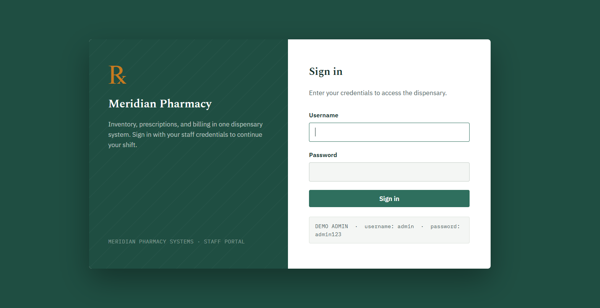
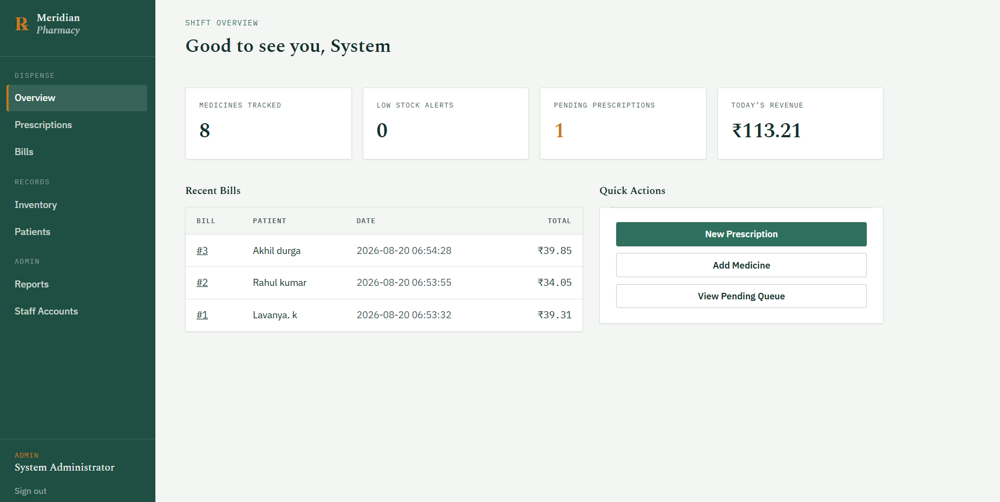
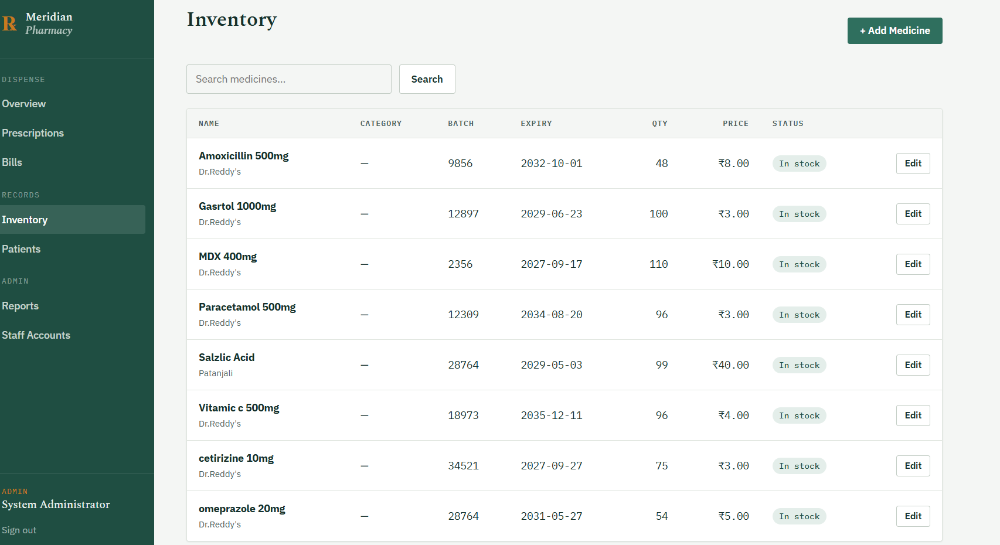
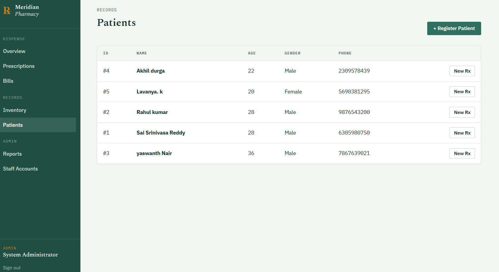
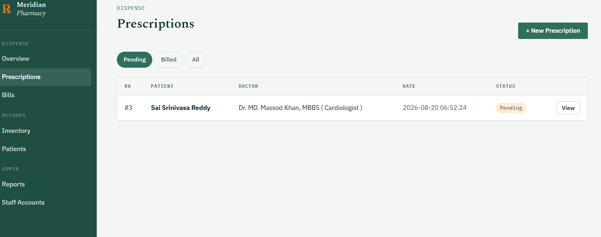
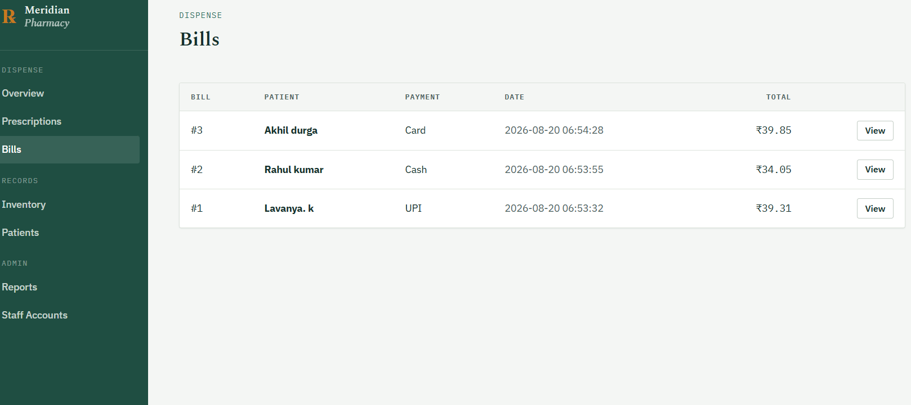
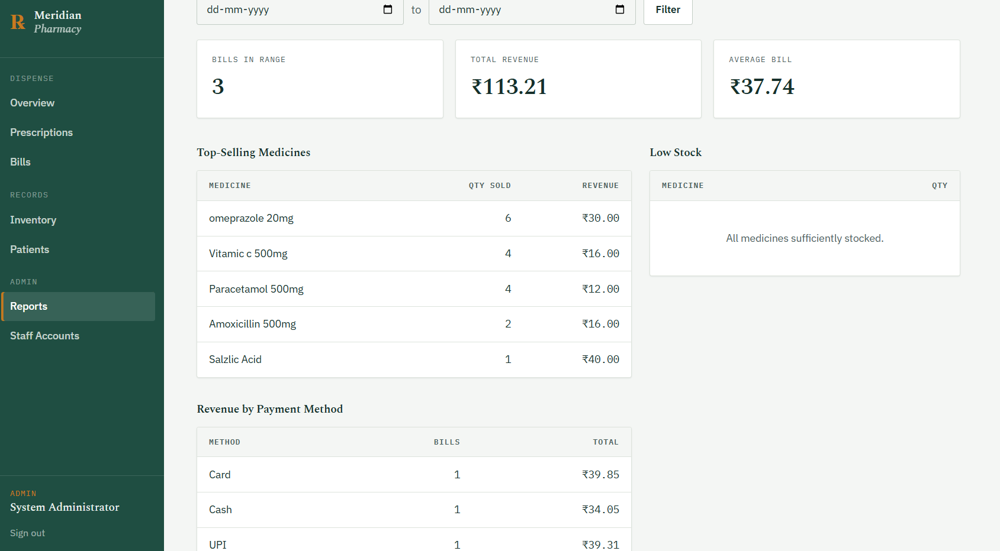

# 💊 Meridian Pharmacy — Smart Pharmacy Management System

<p align="center">
  <strong>A full-stack web-based pharmacy management system built with Flask and SQLite.</strong>
</p>

<p align="center">
  Manage medicines, patients, prescriptions, billing, staff accounts, and reports through a modern web interface.
</p>

<p align="center">


</p>

---

## 📌 Project Overview

**Meridian Pharmacy** is a full-stack pharmacy management system designed to digitize and simplify common pharmacy operations.

The application provides a centralized platform for:

- 💊 Medicine inventory management
- 👥 Patient management
- 📝 Prescription management
- 🧾 Billing and receipt generation
- 👨‍⚕️ Staff account management
- 📊 Sales and inventory reports
- 🔐 Authentication and role-based access control

The backend is built with **Python Flask**, data is stored using **SQLite**, and the frontend uses **HTML, CSS, JavaScript, and Jinja2 templates**.

---

## ✨ Key Features

### 🔐 Authentication & Authorization

- Secure login system
- Session-based authentication
- Role-based access control
- Admin and Pharmacist roles
- Password hashing using Werkzeug
- Protected server-side routes

### 💊 Medicine Management

- Add medicines
- Edit medicine information
- Track inventory quantity
- Monitor low-stock medicines
- Search medicine inventory
- Automatically deduct stock after billing

### 👥 Patient Management

- Register patients
- View patient records
- Search patient information
- Connect patients with prescriptions and bills

### 📝 Prescription Management

- Create prescriptions
- Add multiple medicines dynamically
- View prescription details
- Track pending and billed prescriptions
- Connect prescriptions directly to billing

### 🧾 Billing System

- Generate bills from prescriptions
- Automatic subtotal calculation
- Discount support
- Tax calculation
- Stock validation
- Automatic inventory deduction
- Printable bill receipts

### 📊 Reports & Dashboard

- Medicine inventory statistics
- Low-stock alerts
- Pending prescription count
- Daily revenue
- Sales summary
- Top-selling medicines
- Revenue by payment method

### 👨‍💼 Staff Management

- Admin can create Pharmacist accounts
- Admin can manage staff accounts
- Different permissions for Admin and Pharmacist users

---

## 🖥️ Screenshots

### 🔐 Login



### 📊 Dashboard



### 💊 Medicine Inventory



### 👥 Patients



### 📝 Prescriptions



### 🧾 Billing



### 🧾 Reports




> **Note:** Make sure the filenames above exactly match the files inside the `Screenshots/` folder.

---

## 🛠️ Technology Stack

| Technology | Purpose |
|------------|---------|
| **Python** | Backend programming |
| **Flask** | Web application framework |
| **SQLite** | Database |
| **HTML5** | Page structure |
| **CSS3** | UI styling |
| **JavaScript** | Client-side interactions |
| **Jinja2** | Dynamic HTML templates |
| **Werkzeug** | Password hashing and Flask utilities |

---

## 🏗️ Architecture

```text
                    ┌─────────────────────┐
                    │      Browser        │
                    │ HTML/CSS/JavaScript │
                    └──────────┬──────────┘
                               │
                               ▼
                    ┌─────────────────────┐
                    │      Flask App      │
                    │       app.py        │
                    │ Routes + Auth + RBAC│
                    └──────────┬──────────┘
                               │
                               ▼
                    ┌─────────────────────┐
                    │     Data Layer      │
                    │    database.py      │
                    └──────────┬──────────┘
                               │
                               ▼
                    ┌─────────────────────┐
                    │       SQLite        │
                    │    pharmacy.db      │
                    └─────────────────────┘
